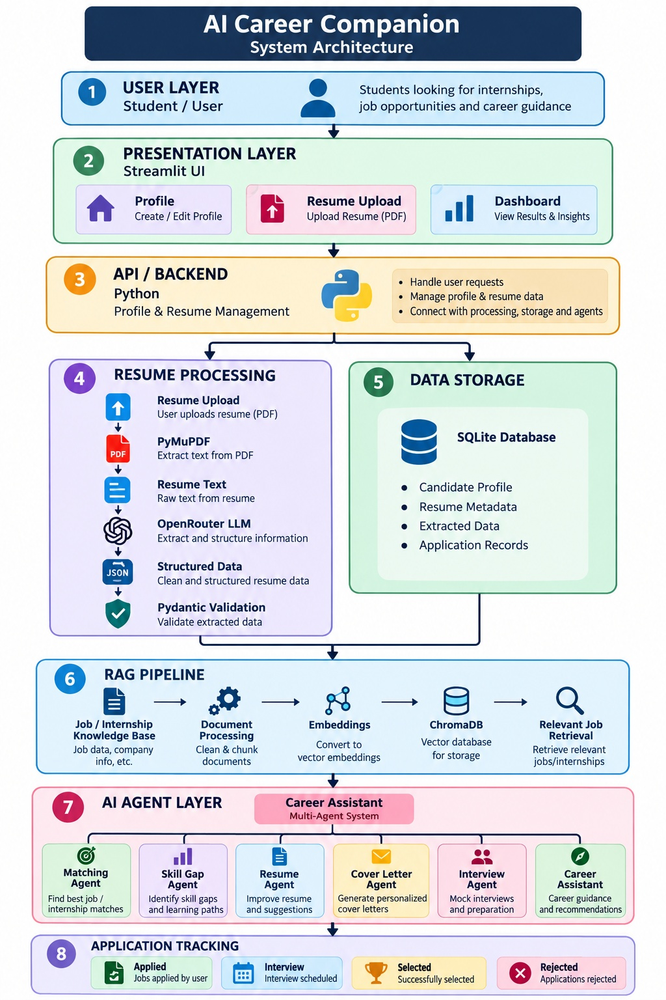

# 🤖 AI Career Companion Agent
### Internship Matching & Interview Preparation Assistant

> **Infosys Springboard Virtual Internship**
> **Milestone 1 — Foundation & Candidate Understanding**
> **Submission Deadline:** 28th August (Friday)

---

## 📌 Project Overview

The **AI Career Companion Agent** is an AI-powered career assistance system built to support students through their internship and early-career journey — from building a structured profile, to parsing resumes with an LLM, to (eventually) matching internships, closing skill gaps, and preparing for interviews.

Milestone 1 lays the foundation: a working student profile + resume upload flow, and an LLM-driven pipeline that turns an unstructured PDF resume into a clean, validated, structured candidate profile stored in a database. The architecture is designed to scale into a full **RAG-based multi-agent career assistant** in later milestones.

---

## 🎯 Problem Statement

Students face several recurring pain points during internship applications:

- Finding internships that genuinely match their skills is time-consuming.
- Resumes are unstructured text, making manual analysis difficult and inconsistent.
- Identifying skill gaps against a target role is hard without guidance.
- Writing tailored resumes and cover letters for every application takes effort.
- Interview preparation resources are scattered and generic.
- Tracking multiple applications across companies quickly becomes messy.

The AI Career Companion Agent addresses these problems by combining structured profile data, LLM-based extraction, and (in future milestones) retrieval-augmented, multi-agent career guidance.

---

## 🎯 Objectives

1. Simplify the internship application workflow end-to-end.
2. Build a structured digital candidate profile from raw resume data.
3. Provide profile creation and resume upload functionality.
4. Parse PDF resumes automatically and reliably.
5. Extract structured skills, education, and experience using an LLM.
6. Persist candidate information in a database.
7. Lay the groundwork for internship/job matching via RAG.
8. Identify candidate skill gaps against target roles.
9. Support resume improvement and cover letter generation.
10. Provide AI-assisted interview preparation.
11. Evolve into a scalable, multi-agent career assistant.

---

## ✅ Milestone 1 Scope

**Foundation & Candidate Understanding**

| # | Requirement |
|---|-------------|
| 1 | Study internship application workflows, RAG architecture, and multi-agent design patterns |
| 2 | Design system architecture, agent roles, and candidate profile data models |
| 3 | Develop student profile creation and resume upload functionality |
| 4 | Implement resume parsing and structured skill/experience extraction using an LLM |

**Submission deliverables:** GitHub Repository · System Architecture · Technology Stack

---

## 🧩 Milestone 1 Breakdown

### M1.1 — Research & Technical Understanding
- Studied end-to-end internship application workflows.
- Researched Retrieval-Augmented Generation (RAG) architecture and how it applies to job/internship matching.
- Studied multi-agent design patterns for splitting career-assistance responsibilities across specialized agents.
- Documented findings and justified the technology choices used in this project.

### M1.2 — System Architecture
- Designed the overall system architecture (see diagram below).
- Defined responsibilities for each of the six planned agents: **Job-Resume Matching Agent, Skill Gap Agent, Resume Agent, Cover Letter Agent, Interview Agent, and Career Assistant (orchestrator)**.
- Designed the candidate/student profile schema.
- Defined the data flow from resume upload → parsing → LLM extraction → structured profile → storage.

### M1.3 — Student Profile Module ✅ *Implemented*
- Built student profile creation (name, email, phone, education, skills, experience, projects, certifications, career interests).
- Implemented resume upload (PDF) through the Streamlit interface.
- Stored profile data and resume metadata (file name, upload info, linked candidate ID) in the database.

### M1.4 — Resume Parsing & Extraction ✅ *Implemented*
- Parsed uploaded PDF resumes using **PyMuPDF** to extract raw text.
- Sent extracted text to an LLM (via **OpenRouter API**) to pull out structured skills, education, experience, and projects.
- Validated the LLM's structured JSON output using **Pydantic** before storage.
- Stored the final structured candidate profile in **SQLite**.
- Tested the extraction pipeline against multiple sample resumes with varying formats to check robustness and accuracy.

> Together, M1.3 and M1.4 form the **currently implemented, working pipeline** for this milestone. M1.1 and M1.2 represent the research and design work that shaped this implementation.

---

## 🏗️ System Architecture

The system is organized into layers, moving from user interaction down to storage, with a future RAG + multi-agent layer sitting on top of the candidate data.

**Core components:**

- **Student / User Interface** — where students create profiles and upload resumes
- **Backend / API Layer** — orchestrates profile management, resume processing, and LLM calls
- **Resume Upload / Storage** — handles incoming PDF files
- **Resume Parsing Module** — extracts raw text from PDFs
- **LLM (via OpenRouter)** — converts raw text into structured data
- **Candidate Profile** — validated, structured representation of a student
- **Database** — persistent storage for profiles and resume metadata
- **Job-Posting Knowledge Base** *(planned)* — internship/job data for retrieval
- **RAG Pipeline** *(planned)* — retrieves relevant job data to ground agent responses
- **AI Agent Layer** *(planned)* — the six specialized agents
- **Application Tracking Module** *(planned)* — tracks applications through their lifecycle

### Architecture Diagram



### Layered View

```text
┌─────────────────────────────────────────────────────────────┐
│                        USER LAYER                            │
│              Student: creates profile, uploads resume        │
└───────────────────────────┬───────────────────────────────────┘
                             ↓
┌─────────────────────────────────────────────────────────────┐
│                  PRESENTATION LAYER (Streamlit)               │
│   Profile creation UI · Resume upload UI · Results display    │
└───────────────────────────┬───────────────────────────────────┘
                             ↓
┌─────────────────────────────────────────────────────────────┐
│                 BACKEND / API LAYER (Python)                  │
│  Profile management · Resume processing · LLM orchestration   │
│  Data validation · Database operations                        │
└──────────┬───────────────────────────────────┬────────────────┘
           ↓                                   ↓
┌───────────────────────┐         ┌─────────────────────────────┐
│ RESUME PROCESSING      │         │        DATABASE LAYER        │
│ PyMuPDF → Text →       │         │  SQLite: candidate profiles, │
│ OpenRouter LLM →       │────────▶│  resume metadata              │
│ Structured JSON →      │         └─────────────────────────────┘
│ Pydantic Validation    │
└───────────┬────────────┘
            ↓
┌───────────────────────┐
│  CANDIDATE PROFILE     │
│  (structured, stored)  │
└───────────┬────────────┘
            ↓
╔═══════════════════════════════════════════════════════════════╗
║                PLANNED — FUTURE MILESTONES                     ║
║                                                                 ║
║   Job/Internship Knowledge Base → RAG Pipeline (LangChain +    ║
║   ChromaDB) → AI Agent Layer (6 agents) → Career Assistant     ║
║   Orchestrator → Application Tracking Module                   ║
╚═══════════════════════════════════════════════════════════════╝
```

### Data Flow — Resume Upload to Structured Profile *(implemented)*

```text
Resume PDF
   ↓
Resume Upload (Streamlit)
   ↓
PyMuPDF PDF Parser  →  Extracted Resume Text
   ↓
OpenRouter API  →  LLM
   ↓
Structured JSON (name, skills, education, experience, projects, etc.)
   ↓
Pydantic Validation
   ↓
Candidate Profile
   ↓
SQLite Database
```

### Data Flow — Planned RAG + Multi-Agent Layer *(future milestones)*

```text
Student Profile
   ↓
Career Assistant (Orchestrator)
   ↓
User Request
   ↓
RAG Retriever  →  Job / Internship Knowledge Base (ChromaDB)
   ↓
Relevant Job Information
   ↓
Specialized Agent (Job-Resume Matching / Skill Gap / Resume /
                    Cover Letter / Interview)
   ↓
Personalized Career Response
```

---

## 🤖 Planned AI Agent Roles

The following six agents are architected and their responsibilities defined; full implementation is planned for subsequent milestones.

| Agent | Responsibility |
|-------|-----------------|
| **Job-Resume Matching Agent** | Compares candidate skills/education/experience against internship requirements and recommends relevant roles |
| **Skill Gap Agent** | Identifies missing skills relative to a target role and suggests areas to learn |
| **Resume Agent** | Reviews resume quality, flags missing information, and suggests improvements |
| **Cover Letter Agent** | Generates a personalized cover letter using the candidate profile and target job info |
| **Interview Agent** | Generates technical and HR interview questions with preparation guidance |
| **Career Assistant** | Orchestrates the other agents and acts as the main conversational entry point for the student |

---

## 👤 Candidate Profile Schema

```text
CandidateProfile
│
├── name
├── email
├── phone
│
├── skills[]
│
├── education[]
│   ├── degree
│   ├── institution
│   └── year
│
├── experience[]
│   ├── company
│   ├── role
│   ├── duration
│   └── description
│
├── projects[]
│   ├── name
│   ├── description
│   └── technologies[]
│
├── certifications[]
│
└── career_interests[]
```

---

## 🛠️ Technology Stack

| Category | Technology | Purpose |
|---|---|---|
| Programming Language | Python 3.x | Core application development |
| Frontend / UI | Streamlit | Student profile & resume upload interface |
| LLM Provider | OpenRouter API | AI-powered resume analysis and extraction |
| LLM Integration | OpenAI Python SDK | Connects the app to OpenRouter |
| PDF Processing | PyMuPDF | Extracts text from PDF resumes |
| Data Validation | Pydantic | Validates structured candidate information |
| Database | SQLite | Stores candidate profiles and resume metadata |
| Environment Management | python-dotenv | Secure API key management |
| Version Control | Git | Source-code version control |
| Repository | GitHub | Project hosting and submission |
| RAG Framework *(planned)* | LangChain | Future RAG & agent integration |
| Vector Database *(planned)* | ChromaDB | Future job/internship retrieval |
| AI Agents *(planned)* | Python + LLM | Future multi-agent functionality |

### Currently Implemented Stack

```text
Python 3.x → Streamlit → PyMuPDF → OpenRouter API → Pydantic → SQLite → Git/GitHub
```

### Planned Stack (Future Milestones)

```text
Job/Internship Knowledge Base → LangChain → Embeddings → ChromaDB → RAG Pipeline → Multi-Agent Layer
```

---

## 📂 Project Structure

```text
AI-Career-Companion/
│
├── data/
│   └── candidates.db
│
├── database/
│   └── database.py
│
├── images/
│   └── AI_Career_Companion_System_Architecture.png
│
├── models/
│   └── candidate.py
│
├── resume_parser/
│   ├── parser.py
│   └── extractor.py
│
├── venv/
│
├── .env
├── .gitignore
├── app.py
├── requirements.txt
├── test_openrouter.py
└── test_parser.py
```

---

## 🔐 Environment Configuration

Create a `.env` file in the project root:

```env
OPENROUTER_API_KEY=your_openrouter_api_key
```

**`.gitignore` should contain:**

```gitignore
venv/
.env
__pycache__/
*.pyc
data/*.db
```

⚠️ Never commit your API key to GitHub.

---

## ⚙️ Installation & Setup

### 1. Clone the repository
```bash
git clone <your-github-repository-url>
cd AI-Career-Companion
```

### 2. Create a virtual environment

**Windows**
```bash
python -m venv venv
venv\Scripts\activate
```

**macOS / Linux**
```bash
python3 -m venv venv
source venv/bin/activate
```

### 3. Install dependencies
```bash
pip install -r requirements.txt
```
or
```bash
pip install streamlit pymupdf pydantic openai python-dotenv
```

### 4. Configure OpenRouter
Add your key to `.env`:
```env
OPENROUTER_API_KEY=sk-or-v1-your-api-key
```

### 5. Run the application
```bash
streamlit run app.py
```

---

## 🧪 Testing

The resume extraction module was tested with **3–5 sample resumes** in different formats to check robustness and accuracy.

| Field | Verification |
|---|---|
| Name | Correctly extracted |
| Email | Correctly extracted |
| Phone | Correctly extracted |
| Skills | Correctly extracted |
| Education | Correctly extracted |
| Experience | Correctly extracted |
| Projects | Correctly extracted |
| Technologies | Correctly extracted |
| Certifications | Correctly extracted |
| Career Interests | Correctly extracted |

---

## 📈 Milestone 1 Status

### ✅ Implemented
- Python application with Streamlit UI
- Student profile creation
- Resume PDF upload
- PDF text extraction (PyMuPDF)
- OpenRouter API integration
- LLM-based structured resume extraction (skills, education, experience, projects, technologies, certifications)
- Pydantic validation of the candidate profile
- Candidate profile storage in SQLite
- System architecture design
- Six AI agent responsibilities defined
- Technology stack defined

### 🔜 Planned for Subsequent Milestones
- Internship/job knowledge base
- RAG pipeline with LangChain
- Embedding generation & ChromaDB integration
- Job-Resume Matching Agent
- Skill Gap Agent
- Resume Agent
- Cover Letter Agent
- Interview Agent
- Career Assistant orchestration
- Application tracking module
- Advanced, personalized career recommendations
- Deployment

---

## 🔮 Future Work

- **RAG Implementation:** build a job/internship knowledge base, generate embeddings, and retrieve relevant opportunities via a vector database.
- **Multi-Agent Implementation:** build and integrate all six agents under the Career Assistant orchestrator.
- **Application Tracking:** track saved/applied internships, interview schedules, and outcomes.
- **Additional Improvements:** better UI/UX, authentication, analytics dashboard, higher extraction accuracy, more resume formats, deployment.

---

## 🎓 Infosys Springboard Submission

| Field | Details |
|---|---|
| **Project Name** | AI Career Companion Agent for Internship Matching and Interview Preparation |
| **Project Type** | Individual Project |
| **Program** | Infosys Springboard Virtual Internship |
| **Milestone** | Milestone 1 — Foundation & Candidate Understanding |
| **Submission Date** | 28th August (Friday) |
| **Programming Language** | Python |
| **Frontend** | Streamlit |
| **LLM Provider** | OpenRouter API |
| **PDF Parser** | PyMuPDF |
| **Validation** | Pydantic |
| **Database** | SQLite |
| **Repository** | GitHub |

**Required submission:** GitHub Repository link · System Architecture · Technology Stack

---

## ⭐ Key Takeaways

**Currently implemented pipeline:**
```text
Student → Profile Creation → Resume Upload → PDF Parsing → LLM Analysis
        → Structured Candidate Profile → Database Storage
```

**Designed to evolve into:**
```text
Candidate Profile → RAG Pipeline → Job/Internship Knowledge Base → Vector Search
    → Multi-Agent System → Internship Matching → Skill Gap Analysis
    → Resume Improvement → Cover Letter Generation → Interview Preparation
    → Application Tracking
```

---

## ❤️ Acknowledgement

Developed as an individual project under the **Infosys Springboard Virtual Internship Program**.

**Built with:** Python · Streamlit · OpenRouter · PyMuPDF · Pydantic · SQLite · Git · GitHub
